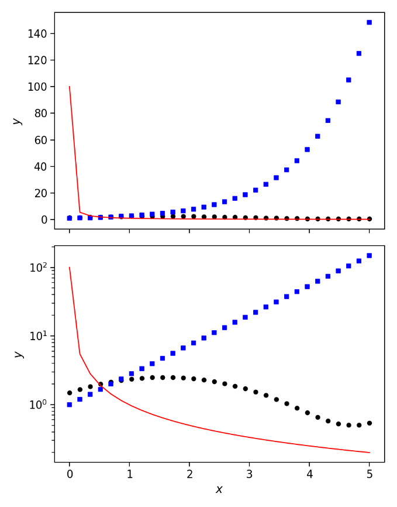
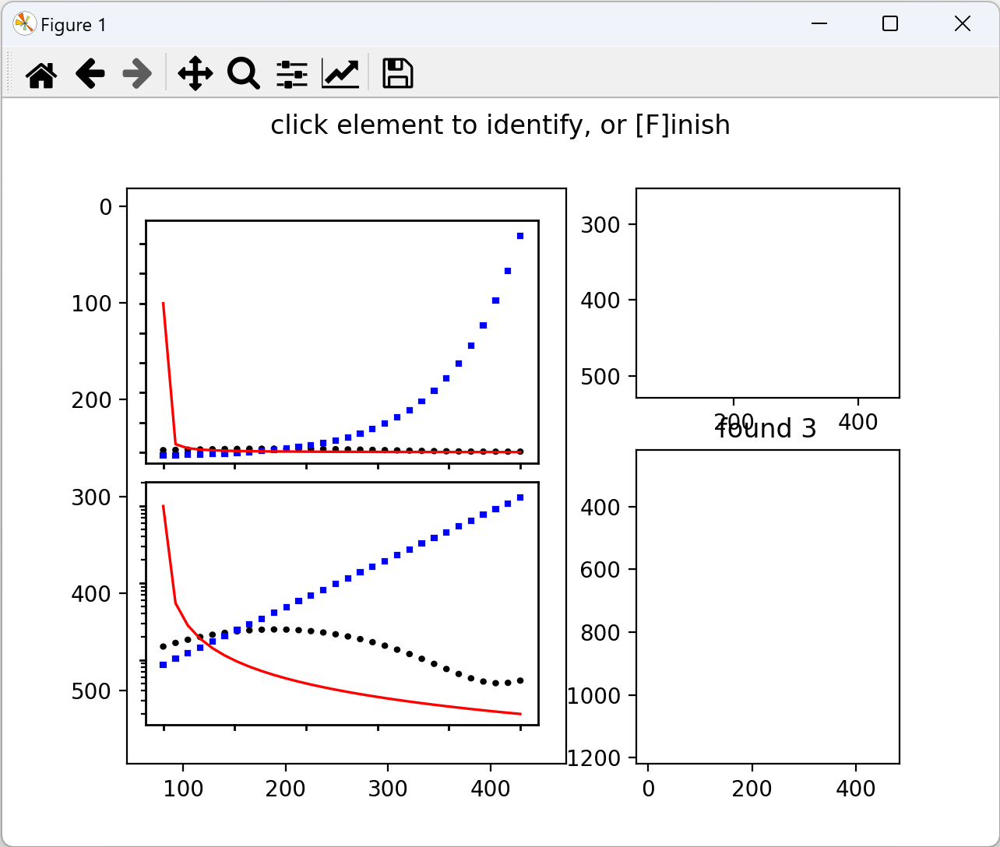
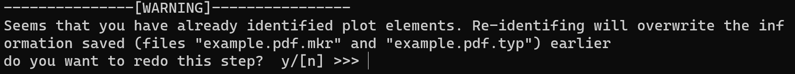
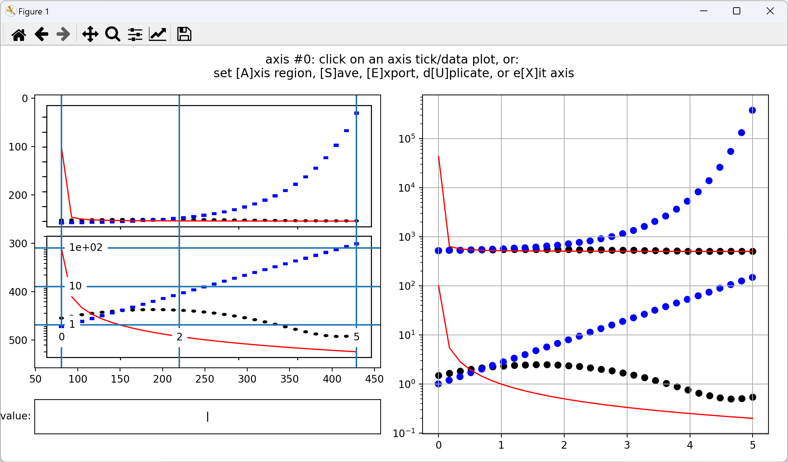
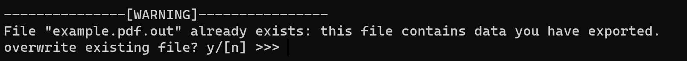

## vector-plot-extractor Tutorial: Extracting Data from Vector Plots in Scientific Papers

You see a figure in a paper and want to extract the data from it.

There are already many tools that focus on raster images: after manually calibrating the axes, they try to identify data points from PNG, JPG, or similar formats using certain algorithms, or let you add points manually. But many figures in modern papers are in vector format (e.g., PDF), where the positions of points (at least the markers of them) or lines are included in the file itself. Also, if the figure contains many overlapping elements, working with raster images may be neither convenient nor accurate. Since the data is already somewhat embedded in the vector image, reverse-engineering it from a raster image is relatively indirect. So when encountering vector graphics, it's preferable to use a tool that directly processes vector data.

I developed a simple tool called `vector-plot-extractor` designed to read vector graphics and extract data. It provides a graphical interface (built with `matplotlib`) to help you perform axis calibration and other necessary steps. `vector-plot-extractor` is available as a Python package, so installing and running it is straightforward if you use package managers like `pip`. While it’s still early in development and not fully optimized, it has already been successfully used to extract data from multiple PDF figures.

Please feel free to try it out and share any suggestions or issues you encounter! Your feedback will help me improve the tool and expand support for more use cases and scenarios. 

### Installation

This package is available on PyPI. If you're using `pip`, simply run the following command in the terminal to install:

```
pip install vector-plot-extractor
```

### Preparing a Vector Plot

If the paper is on arXiv and typeset using LaTeX or similar tools, click "TeX Source" on arXiv to find the source code.

<!--{width="5.024258530183727in" height="1.9725634295713035in"}

Screenshot from arxiv.org -->

If it’s a LaTeX source, it usually comes as a `.tar.gz` file. Open it and you’ll likely find the original vector images (e.g., PDFs). If you cannot find the vector image, you can also use the PDF version of the article and extract the relevant page, though that might introduce more distractions. For this tutorial, we use a sample figure available [here](examples/example.pdf)

The figure looks like this:

{width="3.0788287401574803in" height="3.925080927384077in"}

To extract data from the lower panel of the figure using `vector-plot-extractor`, the interface will look like this. On the right is the reconstructed figure from the extracted data. 

{width="5.768055555555556in" height="3.3868055555555556in"}

### Usage Tutorial

Now, let us go step-by-step.

Assuming your image file is called `example.pdf`, run the following command in your terminal (replace `"example.pdf"` with the full path to your file, or first `cd` into the directory containing it):

```
vpextract example.pdf
```

This will create a new file called `example.pdf.drw` in the same directory.

The **first step** is to tell the program what each element in the figure is—lines, scatters, etc.

A window will pop up like this:

{width="3.907014435695538in" height="3.310566491688539in"}

Click any element in the figure, and it will be displayed in the top right. For example, try clicking the red line, and you'll see this (notice the instructions in the figure’s title bar):

{width="3.780211067366579in" height="3.203122265966754in"}

If an uppercase letter appears in square brackets, it means you can press that lowercase letter on your keyboard to perform the corresponding action (uppercase input not supported currently). Now, the element is white (invisible)—probably a white rectangle commonly found in figures. These elements are useless, so they should be removed. Press `d` to mark the selected element as "discard":

{width="3.986517935258093in" height="3.37793416447944in"}

You can now choose to match all elements with the same color/shape, and mark them the same way. Here, press `o` to match all white-colored elements and mark them as "discard":

{width="4.031896325459318in" height="3.4163845144356957in"}

Press any key to continue. You’ll return to this interface:

{width="3.8557458442694665in" height="3.2671248906386703in"}

Now click the red line again (use zoom if it's hard to select; try the buttons at the top):

{width="3.869012467191601in" height="3.278367235345582in"}

There are four tag types: `scatter`, `line`, `discard`, and `others` (e.g., shading). The red line is a line, so press `l`:

{width="3.7329943132108485in" height="3.1631124234470693in"}

Since all red elements are lines, press `o` to match them all. Matched elements will appear in the bottom-right corner. Press any key to continue. Red lines are now hidden to reduce clutter:

{width="3.677050524934383in" height="3.115708661417323in"}

Now click the blue dots:

{width="3.868400043744532in" height="3.277847769028871in"}

A zoomed-in view appears in the top right—this is a scatter point (blue square). Press `s` to mark it as scatter:

{width="3.918064304461942in" height="3.319928915135608in"}

These squares are all scatters. Press any of `s`, `o`, or `l` to match them:

{width="3.994035433070866in" height="3.3843022747156604in"}

You’ll see 60 such points matched. Press any key to continue. Similarly, tag all elements you want to extract (`line`, `scatter`, `other`) or remove (`discard`). Don’t tag axes or ticks. You’ll end up with something like this:

{width="4.054501312335958in" height="3.4355380577427823in"}

Once done, press `f` to finish.

Now `example.pdf.typ` and `example.pdf.mkr` will be saved in the same directory, recording the step-1 results. If you rerun `vpextract example.pdf`, you’ll be asked whether to redo step 1. If you say yes, previous work will be lost unless backed up.

{width="5.768055555555556in" height="0.6826388888888889in"}

Default is `n` (no). Enter `y` to redo, otherwise step one will be skipped.

**Step 2**: A new window pops up:

{width="3.868863735783027in" height="3.2782392825896762in"}

Here, you can filter elements. Currently only one mode is supported: drag to create a rectangle. Any elements inside will be kept; others will be discarded. Scatters will be automatically grouped and each group will be treated as one element if possible.

Example:

{width="3.9577023184601923in" height="3.3535170603674542in"}

If you don’t need filtering, press `r` to reset:

{width="4.119498031496063in" height="3.490612423447069in"}

Or just close the window to skip.

This creates `example.pdf.sel.obj` with the filtered data.

**Step 3**: Data extraction begins. A new window opens:

{width="5.768055555555556in" height="3.3868055555555556in"}

The left panel shows the plot after filtering, and the bottom-left corner contains an editable textbox. To extract data, you need to add an axis. You can press any number key (e.g., 0) to enter the axis with that index (e.g., axis #0); Even if the axis doesn’t exist yet (initially there are no axes), while holding down the number key, you can see all currently existing axis indices. Press `a` to add an axis:

{width="5.768055555555556in" height="3.3868055555555556in"}

Axis #0 is created. Press `x` to exit; press `0` to re-enter.

To calibrate, click a tick mark (e.g., short vertical bar—not the tick marks on the large box to the left of the figure, but those short lines on the edges of the two smaller boxes inside the large one). After clicking, the following will appear:

{width="5.768055555555556in" height="3.3868055555555556in"}

A blue calibration line appears after entering the value in the textbox and pressing Enter:

{width="5.768055555555556in" height="3.3868055555555556in"}

You can click the line to modify or delete it:

{width="5.768055555555556in" height="3.3868055555555556in"}

Repeat for more x and y ticks (recommend ≥3). If axis is log scale, 3 ticks are required. If incorrect, you'll see an error:

{width="5.768055555555556in" height="3.3868055555555556in"}

Correct the input, and once both axes are calibrated, the plot appears in the right panel:

{width="5.768055555555556in" height="3.3868055555555556in"}

If the axis includes unwanted elements (such as the plots in the upper panel of the extracted image), press `a` to define a region. Use the same drag-to-select method:

{width="5.768055555555556in" height="3.3868055555555556in"}

You’ve now extracted data from axis #0. Press `x` to exit this axis. Since the upper/lower panels share the x-axis, you can press `u` to duplicate the axis, modify y-axis calibration, and reselect region:

{width="5.768055555555556in" height="3.3868055555555556in"}

Press `s` to save axis info to `example.pdf.axes`. The next time you run the program, it will automatically load this information, and you can press the corresponding number key to return to a specific axis. Note: **the program won’t auto-save when closing the window—do it manually!**

You can press `e` to export all extracted data to `example.pdf.out`. If this file already exists, the program will prompt you for confirmation at the beginning of step 3:

{width="5.768055555555556in" height="0.5236111111111111in"}

To load the exported data in code:

```python
from vpextractor import DataExplorer

data = DataExplorer('example.pdf.out')
```

To access data from axis #0:

```python
data[0]
```

It includes `'scatters'` and `'lines'`. For example:

```python
data[0]['scatters'][0]['x']  # x-coordinates of first scatter group
data[0]['scatters'][0]['y']  # y-coordinates
```

<!--Other metadata is also included.-->
